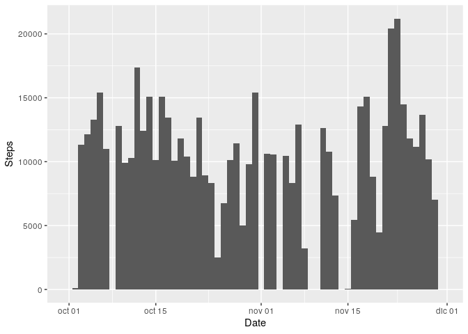
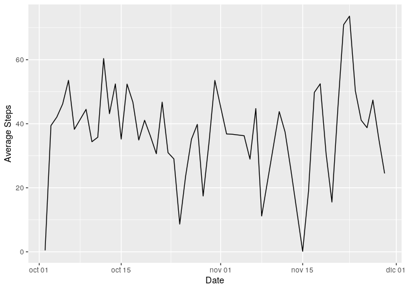
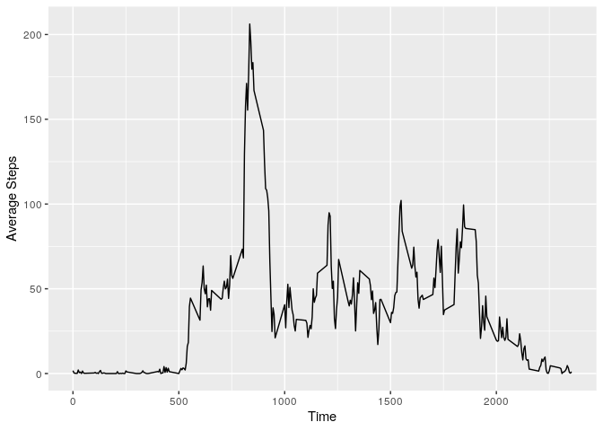
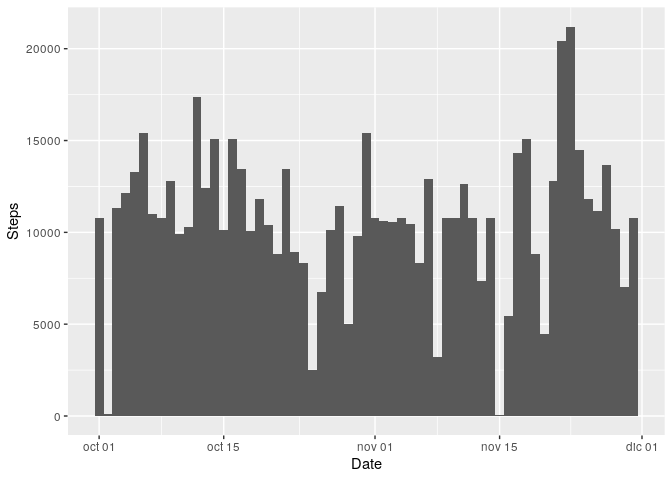
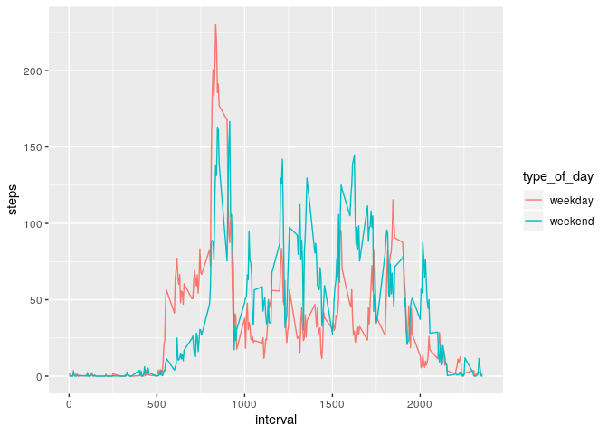

```
## ── Attaching packages ───────────────────────────────────────────────────────────────────────────────────── tidyverse 1.3.0 ──
```

```
## ✓ ggplot2 3.2.1     ✓ purrr   0.3.3
## ✓ tibble  2.1.3     ✓ dplyr   0.8.5
## ✓ tidyr   1.0.2     ✓ stringr 1.4.0
## ✓ readr   1.3.1     ✓ forcats 0.4.0
```

```
## ── Conflicts ──────────────────────────────────────────────────────────────────────────────────────── tidyverse_conflicts() ──
## x dplyr::filter() masks stats::filter()
## x dplyr::lag()    masks stats::lag()
```

&nbsp;


## 1 - Loading and preprocessing the data 

```r
setwd("/home/adrian/Dropbox/R/course-data-science-specialization/week-4/RepData_PeerAssessment1")
activity <- read.table(unz("activity.zip", "activity.csv"), sep = ",", header = TRUE, stringsAsFactors = F)
```
&nbsp;


## 2 - Histogram of the total number of steps taken each day

```r
activity$date <- as.Date(activity$date)
activity %>%
      group_by(date) %>%
      summarise(steps = sum(steps, na.rm = TRUE)) %>%
      ggplot(aes(x = date, weight = steps)) +
      geom_histogram(bins = 61) +
      ylab("Steps") +
      xlab("Date")
```

<!-- -->


## 3 - Mean and median of total number of steps taken per day

```r
mean(activity[, 1], na.rm = TRUE)
```

```
## [1] 37.3826
```

```r
median(activity[, 1], na.rm = TRUE)
```

```
## [1] 0
```

Mean took a low value because of the amount of zero values in the data set, for the same reason, the median is zero. The quantity of zeros is more than a half of the total observations.


## 4 - Time series plot of the average number of steps taken

```r
activity_na <- activity[!is.na(activity$steps), ]
activity_na %>%
      group_by(date) %>%
      summarise(steps = mean(steps, na.rm = TRUE)) %>%
      ggplot(aes(x = date, y = steps)) +
      geom_line() +
      ylab("Average Steps") +
      xlab("Date")
```

<!-- -->


## 5 - The 5-minute interval that, on average, contains the maximum number of steps

```r
activity_na <- activity[!is.na(activity$steps), ]
activity_na %>%
      group_by(interval) %>%
      summarise(steps = mean(steps, na.rm = TRUE)) %>%
      ggplot(aes(x = interval, y = steps)) +
      geom_line() +
      ylab("Average Steps") +
      xlab("Time")
```

<!-- -->


## 6 - Code to describe and show a strategy for imputing missing data

### 1 - Calculate and report the total number of missing values in the dataset (i.e. the total number of rows with NAs)


```r
nrow(activity[is.na(activity$steps), ])
```

```
## [1] 2304
```

### 2 - Devise a strategy for filling in all of the missing values in the dataset. The strategy does not need to be sophisticated. For example, you could use the mean/median for that day, or the mean for that 5-minute interval, etc.

### 3 - Create a new dataset that is equal to the original dataset but with the missing data filled in.


```r
# I am going to calculate the mean of the intervals, and to use this value to replace NA values in the main
# data frame "activity". 
# I create dailyMean data frame calculating the mean by interval
dailyMean <- activity_na %>%
      group_by(interval) %>%
      summarise(stepsMean = mean(steps, na.rm = TRUE))

# activity_steps_mean is going to contain the mean of the steps for each interval where the steps
# in the activity data frame are NA
activity_with_na <- activity[is.na(activity$steps), ] # NA data frame

# Merge NA data frame and dailyMean with an inner join using merge function. The resulting data frame
# will contain the intervals with its respective mean.
activity_steps_mean <- merge(activity_with_na, dailyMean, by.x = "interval", by.y = "interval") 
activity_steps_mean <- select(activity_steps_mean, c(1, 3, 4)) # only keep the variables I need

# I use a for loop to traverse de main data frame "activity"
for (i in 1:nrow(activity)) {
      
      # if variable "step" is NA, enter the if
      if(is.na(activity[i, 1])) {
            
            # date and interval of variable "activity" is save in their respective variables
            fecha <- activity[i, 2]
            intervalo <- activity[i, 3]
            
            # Go through the data frame "dailyMean" that contains the mean of the intervals where
            # where "steps" in "activity" data frame is NA
            for (t in 1:nrow(activity_steps_mean)) {
                  
                  # if interval in activity_steps_mean is equal the interval in activity and
                  # the dates are the same too, enter the if and change the value from NA with
                  # the mean that is in the activity_steps_mean value in third column.
                  if(activity_steps_mean[t, 1] == intervalo & activity_steps_mean[t, 2] == fecha)
                  {
                        activity[i, 1] <- activity_steps_mean[t, 3]
                  }
            }
      }
}
```


## 7 - Histogram of the total number of steps taken each day after missing values are imputed

### 4 - Make a histogram of the total number of steps taken each day and Calculate and report the mean and median total number of steps taken per day. Do these values differ from the estimates from the first part of the assignment? What is the impact of imputing missing data on the estimates of the total daily number of steps?


```r
activity$date <- as.Date(activity$date)
activity %>%
      group_by(date) %>%
      summarise(steps = sum(steps, na.rm = TRUE)) %>%
      ggplot(aes(x = date, weight = steps)) +
      geom_histogram(bins = 61) +
      ylab("Steps") +
      xlab("Date")
```

<!-- -->

The general impact is not noticeable, but what the graphics shows is that all the intervals have a quantity of steps to show, there is no blanks like in the graphics of the point two. We can observe two intervals where the steps are few, that is because in those intervals there was not a step at all, so, I imputed only the mean calculated as I explain in point six.  
  
  

```r
mean(activity[, 1], na.rm = TRUE)
```

```
## [1] 37.3826
```

```r
median(activity[, 1], na.rm = TRUE)
```

```
## [1] 0
```

The mean does not change because the way I use to imputed missing values, generates that the mean of those observations (2304) is almost the same than the mean without observations that contain NA values. The median remain zero for the same reason I explained in the point number three.


## 8 - Panel plot comparing the average number of steps taken per 5-minute interval across weekdays and weekends


```r
activity$weekday = weekdays(activity$date)

for(i in 1:nrow(activity)){
      
      if(activity[i, 4] == "sábado" | activity[i, 4] == "domingo")
      {
            activity[i, 5] <- "weekend"
      }
      else
      {
            activity[i, 5] <- "weekday"
      }
}

activity$type_of_day <- as.factor(activity[, 5])
str(activity)
```

```
## 'data.frame':	17568 obs. of  6 variables:
##  $ steps      : num  1.717 0.3396 0.1321 0.1509 0.0755 ...
##  $ date       : Date, format: "2012-10-01" "2012-10-01" ...
##  $ interval   : int  0 5 10 15 20 25 30 35 40 45 ...
##  $ weekday    : chr  "lunes" "lunes" "lunes" "lunes" ...
##  $ V5         : chr  "weekday" "weekday" "weekday" "weekday" ...
##  $ type_of_day: Factor w/ 2 levels "weekday","weekend": 1 1 1 1 1 1 1 1 1 1 ...
```


```r
activity %>%
      group_by(interval, type_of_day) %>%
      summarise(steps = mean(steps, na.rm = TRUE)) %>%
      ggplot(aes(x = interval, y = steps, color = type_of_day)) +
      geom_line()
```

<!-- -->


